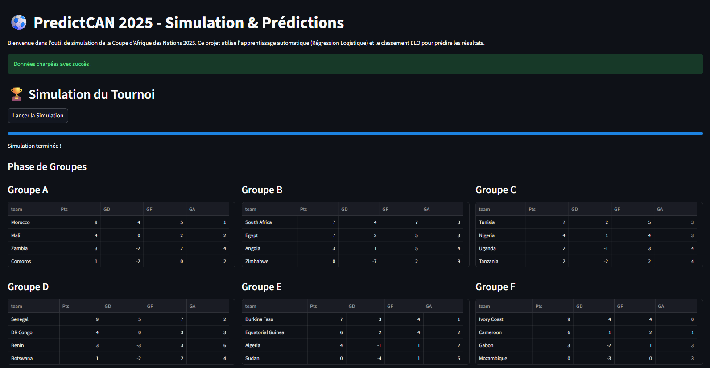
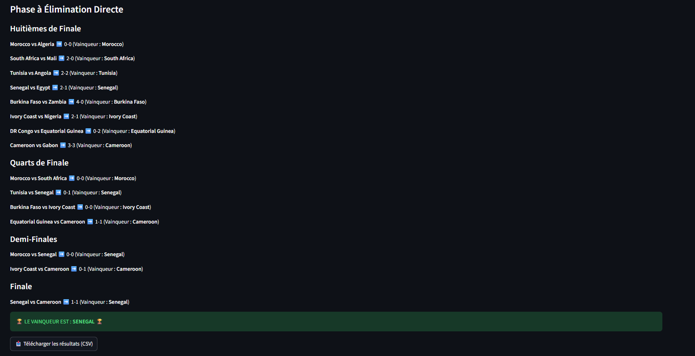
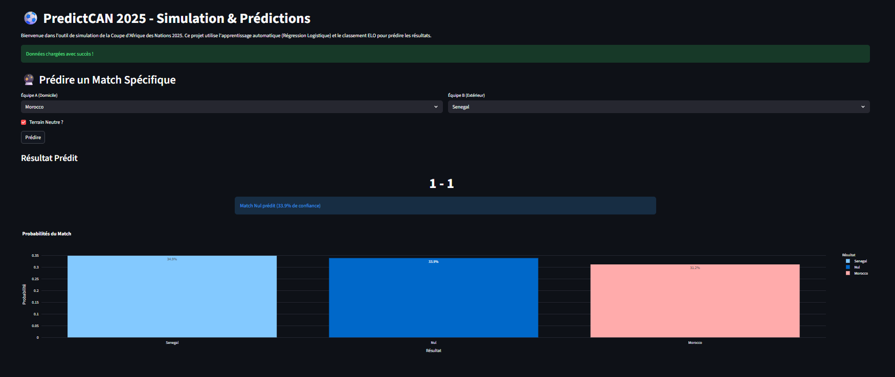
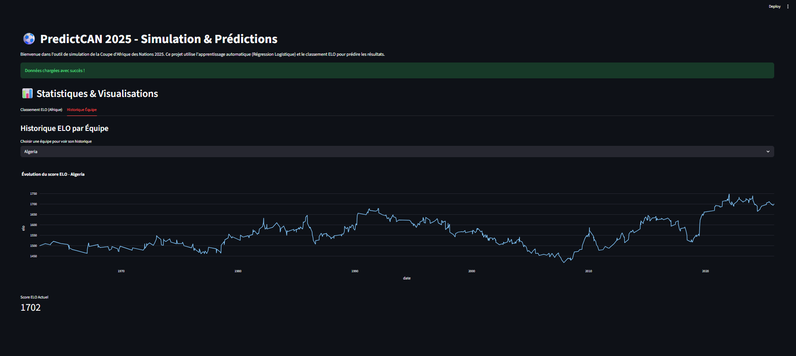

# PredictCAN

## Description

PredictCAN est un projet de prédiction des résultats de la Coupe d'Afrique des Nations (CAN) en utilisant des données historiques de matchs de football, des classements ELO et des modèles de machine learning. Le projet vise à analyser les performances des équipes africaines et à prédire les issues des matchs lors de tournois majeurs.

## Fonctionnalités

- **Analyse Exploratoire des Données (EDA)** : Exploration des données historiques pour identifier les tendances et les facteurs influençant les résultats des matchs.
- **Modélisation** : Utilisation de modèles de machine learning comme la régression logistique pour prédire les résultats des matchs.
- **Prédiction** : Prédiction des scores et des vainqueurs pour des matchs spécifiques.
- **Simulation de Tournoi** : Simulation complète d'un tournoi de la CAN avec des prédictions pour chaque phase.
- **Interface Web Interactive** : Application Streamlit pour visualiser les simulations, prédire des matchs et explorer les statistiques.
- **Visualisation de l'Arbre du Tournoi** : Affichage interactif du bracket de la phase finale.
- **Gestion des Prolongations et Tirs au But** : Simulation réaliste des matchs nuls en phase éliminatoire.
- **Visualisation** : Graphiques et visualisations pour analyser les performances des équipes et les prédictions.

## Méthodologie

Ce projet adopte une approche **Data-Driven** :

1.  **Feature Engineering** : Utilisation de l'algorithme **ELO** pour classer dynamiquement les équipes en fonction de leur historique. Intégration des points FIFA et de l'avantage du terrain.
2.  **Modélisation** : Entraînement d'un modèle de **Régression Logistique** sur des décennies de matchs pour estimer les probabilités de victoire, nul ou défaite.
3.  **Simulation** : Utilisation de méthodes de Monte Carlo (tirages aléatoires pondérés par les probabilités) pour simuler le déroulement du tournoi.

## Aperçu de l'Interface

Voici un aperçu de l'application Streamlit :

### Page d'Accueil et Simulation du Tournoi


*Simulation complète du tournoi avec résultats des groupes et phase finale.*

### Prédiction de Match Spécifique

*Prédiction détaillée d'un match avec probabilités et score estimé.*

### Statistiques ELO


*Classement et historique ELO des équipes africaines.*

## Structure du Projet

- `app.py` : Application web Streamlit pour l'interface utilisateur.
- `main.py` : Script principal pour exécuter les prédictions et simulations en ligne de commande.
- `data/` : Dossier contenant les données brutes et traitées.
  - `raw/` : Données brutes (résultats de matchs, classements FIFA).
  - `processed/` : Données nettoyées et préparées pour la modélisation.
- `models/` : Modèles de machine learning sauvegardés (joblib, pickle).
- `notebooks/` : Jupyter notebooks pour l'analyse, la modélisation et la visualisation.
- `scripts/` : Scripts Python pour le calcul des classements ELO, la simulation de tournois et la visualisation des brackets.
- `requirements.txt` : Liste des dépendances Python.

## Installation

1. Clonez le dépôt :
   ```
   git clone https://github.com/RayaneRZ24/PredictCAN.git
   cd PredictCAN
   ```

2. Créez un environnement virtuel :
   ```
   python -m venv venv
   venv\Scripts\activate  # Sur Windows
   ```

3. Installez les dépendances :
   ```
   pip install -r requirements.txt
   ```

## Utilisation

1. **Calcul des Classements ELO** :
   ```
   python scripts/elo_ranking.py
   ```

2. **Simulation d'un Tournoi** :
   ```
   python scripts/simulate_tournament.py
   ```

3. **Exécution du Script Principal (CLI)** :
   ```
   python main.py
   ```

4. **Lancement de l'Application Web** :
   ```
   streamlit run app.py
   ```

5. **Exploration avec les Notebooks** : Ouvrez les notebooks dans Jupyter pour analyser les données et visualiser les résultats.

## Technologies Utilisées

- Python
- Streamlit pour l'interface web
- Pandas, NumPy pour la manipulation des données
- Scikit-learn pour les modèles de machine learning
- Plotly pour les visualisations interactives
- Jupyter Notebook pour l'analyse interactive

## Contribution

Les contributions sont les bienvenues ! Veuillez ouvrir une issue ou soumettre une pull request pour toute amélioration.

## Licence

Ce projet est sous licence MIT. Voir le fichier LICENSE pour plus de détails.
